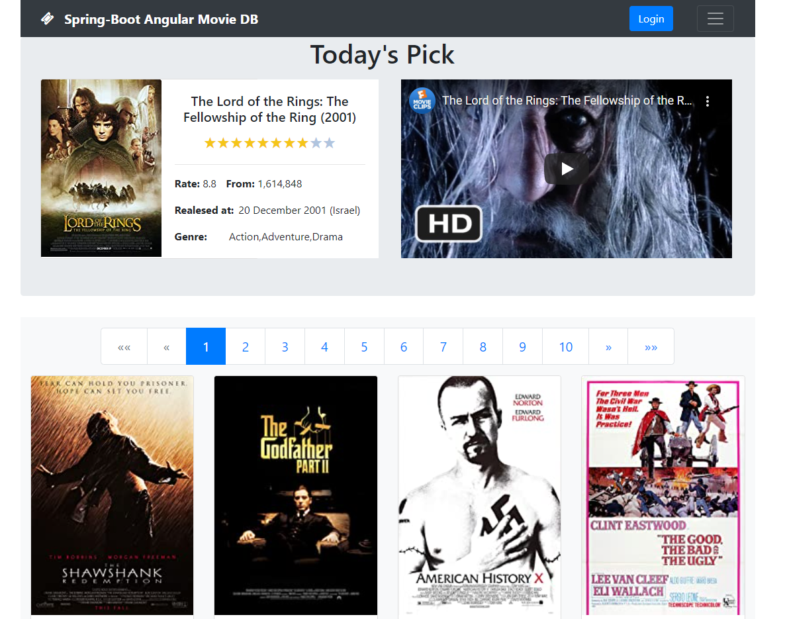
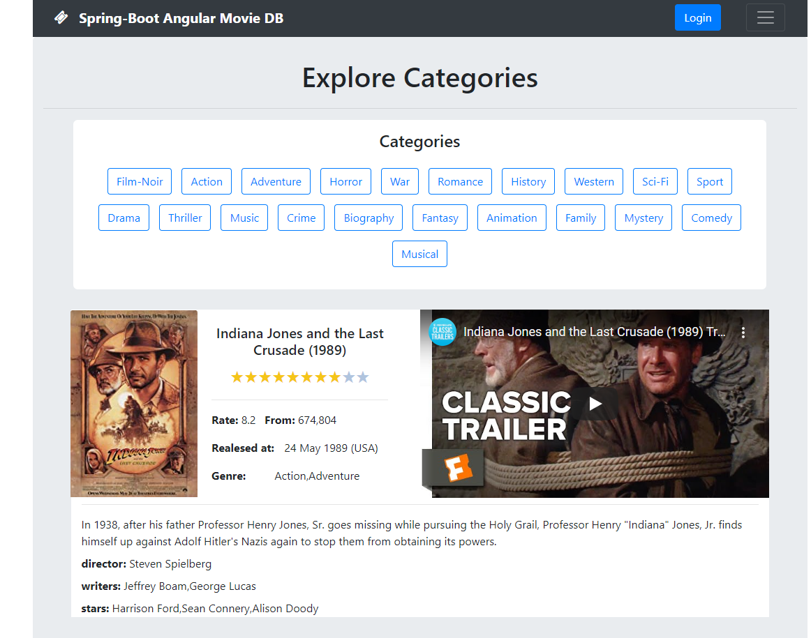

# spring-angular-demo Application
This Java Spring-Boot 2 application demonstrate an online database of information related to films similar to IMDB
Demo can be found in this link https://oren-hoffman.com/spring-angular-demo/

## Git Branches
- master - For deploying a Spring-Boot application as a Tomcat war/ Embedded Tomcat jar files
- spring-angular-demo-wildfly - For deploying a Spring-Boot application as a Wildfly/Jboss (or any other JEE application server) war file

# Module Major Dependencies
- Spring-Boot V2.3.1.RELEASE
- Spring-Data V2.3.1.RELEASE
- Spring-Security V2.3.1.RELEASE

# Server Specifications
- Java Maven project
- Spring-Boot
- Persistence - Spring-JPA-repository
- H2 embedded DB

# Client Specifications
- Angular V6
- Bootstrap 4

# Environment
 - Ubuntu/Windows
 
# Requirements
- JVM
- Full application build before running

## Build Application
- development
    - `$ mvn clean install -Pbuild-dev`
      
- Production
    - `$ mvn clean install -Pbuild-prod`
    
    
## Running Up Environment (After build completed)
- server
    - directory : `/spring-angular-demo/`
    - `$ mvn spring boot:run`
      
- client
    - directory : `/spring-angular-demo/angular-client`
    - `$ ng serve`

## Accessing UI
- Local: http://localhost:8080/
- Demo: https://oren-hoffman.com/spring-angular-movie/

## Images

# Contact
- For any questions you can send a mail to orenhoffman1777@gmail.com
